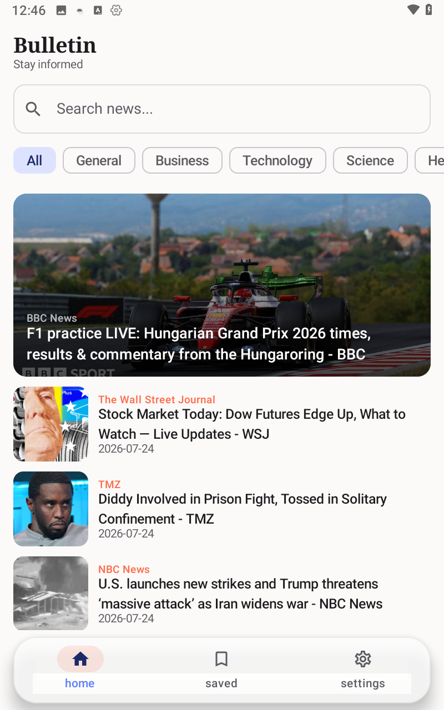
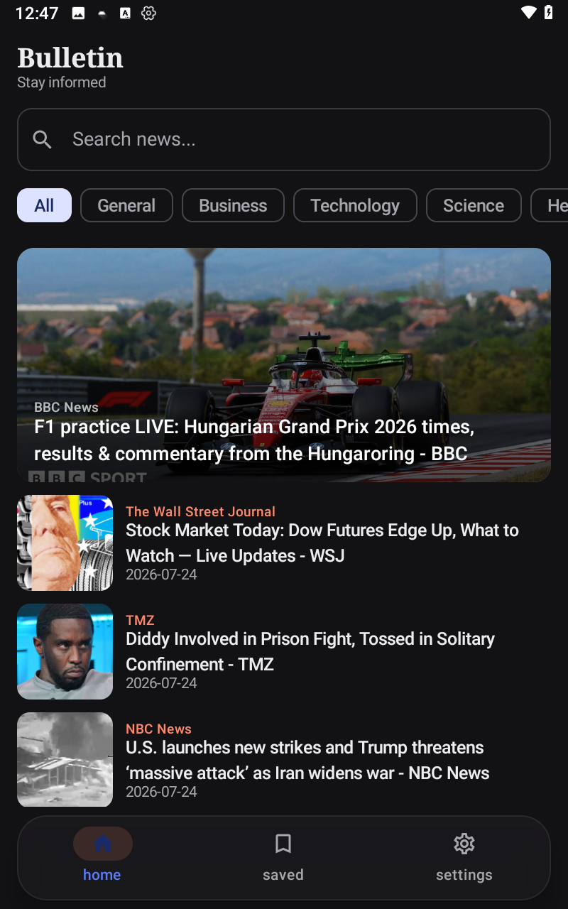
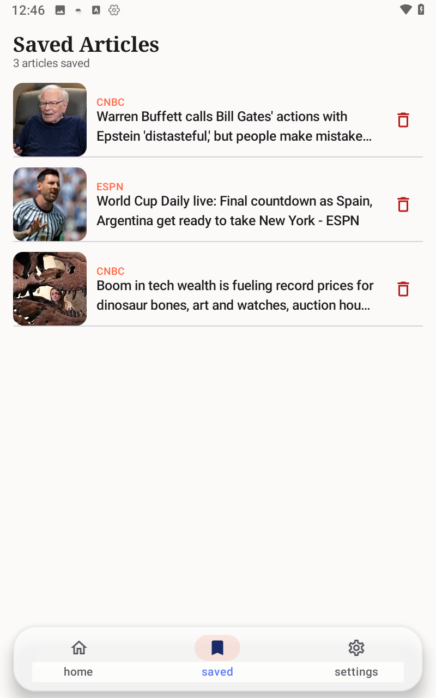
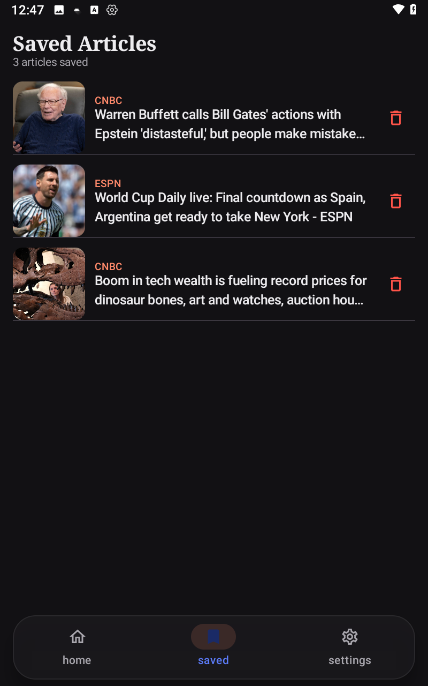
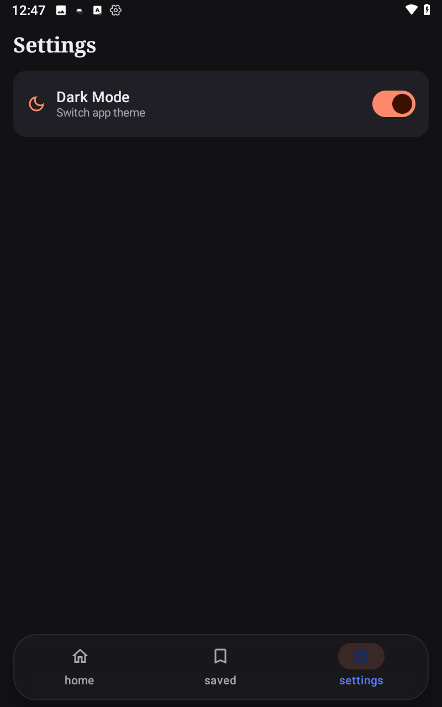

<div align="center">

# 📰 Bulletin News

**A modern, offline-first news application built with Jetpack Compose**

*یک اپلیکیشن خبری مدرن و آفلاین-فرست، ساخته‌شده با Jetpack Compose*

[](https://kotlinlang.org)
[](https://developer.android.com/jetpack/compose)
[]()
[]()
[](#license--لایسنس)

</div>

---

## 🇬🇧 English

### Overview

**Bulletin News** is a fully offline-first news reader built to demonstrate production-grade Android architecture using **Jetpack Compose** and modern Android Jetpack libraries. It fetches live headlines from the [NewsAPI.org](https://newsapi.org) REST API, caches everything locally with **Room**, and keeps the UI always populated — online or offline — through a strict **Single Source of Truth** pattern powered by the **Paging 3** library and a custom `RemoteMediator`.

The project was built as a personal portfolio piece to showcase real-world patterns: layered clean architecture, structured error handling, background sync with WorkManager, push notifications, type-safe navigation, and a polished UI with skeleton loaders and Lottie animations.

### 📱 Screenshots

<table>
  <tr>
    <td align="center"><b>Home (Light)</b></td>
    <td align="center"><b>Home (Dark)</b></td>
    <td align="center"><b>Article Detail</b></td>
  </tr>
  <tr>
    <td></td>
    <td></td>
    <td></td>
  </tr>
  <tr>
    <td align="center"><b>Saved Articles (Light)</b></td>
    <td align="center"><b>Saved Articles (Dark)</b></td>
    <td align="center"><b>Settings (Light / Dark)</b></td>
  </tr>
  <tr>
    <td></td>
    <td></td>
    <td></td>
  </tr>
</table>

### ✨ Features

- 🌐 **Live headlines & search** — fetched from NewsAPI via Retrofit, with category filters (General, Business, Technology, Science, Health...) and debounced search
- 📴 **Offline-first** — every article is cached in Room; the app is fully usable with no connection, following a strict Single Source of Truth pattern
- 📄 **Infinite pagination** — implemented with **Paging 3** + a custom `RemoteMediator` that syncs remote pages into the local database transactionally
- 🔖 **Bookmarks** — save/remove articles locally, persisted independently of the paged cache
- 🔔 **Push notifications** — a periodic **WorkManager** job (every 6h, network-constrained) checks for fresh headlines and notifies the user
- 📡 **Reactive connectivity awareness** — a `ConnectivityManager`-based observer exposes real-time online/offline state to the whole app and triggers an immediate sync when the connection comes back
- 🧯 **Structured error handling** — a custom `Resource<T>` sealed class + `safeApiCall` wrapper + a typed `AppError` hierarchy (No Internet, Unauthorized, Rate Limited, Server Error...) with per-error retry semantics
- 🧭 **Type-safe navigation** — Jetpack Navigation Compose with `kotlinx.serialization`-backed routes (including passing a full `Article` object as a type-safe nav argument) and shared-element transitions
- 🎨 **Material 3 design** — dynamic theming with full light/dark mode support (persisted via DataStore)
- 💀 **Skeleton loading** — custom shimmer-brush placeholders for a smooth perceived-performance experience
- 🎞️ **Lottie animations** — for empty/error/loading states
- 🧩 **Dependency Injection** — fully wired with Dagger Hilt (including `@HiltWorker` for WorkManager integration)

### 🏗️ Architecture

The app follows **Clean Architecture** principles with a classic **MVVM** presentation layer, split into three independent layers:

```
presentation/   →  Compose UI + ViewModels (UI State, one-way data flow)
      ↓
domain/         →  Use Cases + Repository interfaces + pure Kotlin models
      ↓
data/           →  Repository implementations, Retrofit API, Room DB, mappers
```

**Data flow (offline-first, Single Source of Truth):**

```
   ┌──────────────┐        ┌───────────────────┐        ┌─────────────┐
   │  NewsApi     │──────▶ │ ArticlesRemoteMediator│──▶ │  Room DB    │
   │  (Retrofit)  │        │   (Paging 3)        │      │ (Cache/SoT) │
   └──────────────┘        └───────────────────┘        └──────┬──────┘
                                                                  │
                                                          Flow<PagingData>
                                                                  │
                                                                  ▼
                                                        ┌────────────────┐
                                                        │  ViewModel /   │
                                                        │  Compose UI    │
                                                        └────────────────┘
```

The UI **never** talks to the network directly — it always observes Room through a `Pager`. The `RemoteMediator` is solely responsible for keeping the local cache fresh, which means the same code path serves both the "online" and "offline" cases transparently.

### 🛠️ Tech Stack

| Category | Library / Tool |
|---|---|
| Language | Kotlin |
| UI | Jetpack Compose, Material 3, Shared Element Transitions |
| Architecture | MVVM, Clean Architecture (data / domain / presentation) |
| Dependency Injection | Dagger Hilt (`hilt-navigation-compose`, `hilt-work`) |
| Networking | Retrofit2, OkHttp, `kotlinx.serialization` (JSON converter) |
| Pagination | Paging 3 (`Pager`, `RemoteMediator`, `PagingSource`) |
| Local Storage | Room (cache + bookmarks), DataStore Preferences (settings) |
| Background Work | WorkManager (periodic sync + `HiltWorker`) |
| Navigation | Navigation Compose + `kotlinx.serialization` type-safe routes |
| Image Loading | Coil 3 |
| Animations | Lottie Compose, custom shimmer/skeleton brushes |
| Async | Kotlin Coroutines & Flow (`StateFlow`, `combine`, `flatMapLatest`, `debounce`) |

### 🧯 Error Handling Design

```kotlin
sealed class Resource<T> {
    data class Success<T>(val data: T) : Resource<T>()
    data class Error<T>(val error: AppError) : Resource<T>()
    data class Loading<T>(val progress: Int? = null) : Resource<T>()
}

suspend fun <T> safeApiCall(apiCall: suspend () -> Response<T>): Resource<T> { ... }
```

Every network-related failure is normalized into a typed `AppError` (`NoInternet`, `Unauthorized`, `RateLimited`, `ServerError`, `Unknown`), each carrying a user-facing message and an `isRetryable` flag — which `NewsSyncWorker` uses directly to decide between `Result.retry()` and `Result.failure()`.

### 🚀 Getting Started

1. Clone the repository
   ```bash
   git clone https://github.com/<your-username>/bulletin-news.git
   ```
2. Get a free API key from [newsapi.org](https://newsapi.org/register)
3. Add it to your `local.properties`:
   ```properties
   NEWS_API_KEY=your_api_key_here
   ```
   *(the key is injected into `BuildConfig` and never hardcoded in source)*
4. Open the project in **Android Studio (Koala or newer)** and run it on API 26+

### 📄 License / لایسنس

This project is licensed under the [MIT License](LICENSE).

---

## 🇮🇷 فارسی

### معرفی پروژه

**Bulletin News** یک اپلیکیشن خبرخوان کاملاً **آفلاین-فرست (Offline-First)** است که برای نمایش یک معماری حرفه‌ای و آماده‌ی پروداکشن در اندروید، با **Jetpack Compose** و کتابخانه‌های مدرن Jetpack نوشته شده است. اخبار به‌صورت زنده از API سایت [NewsAPI.org](https://newsapi.org) دریافت می‌شود، در دیتابیس محلی (**Room**) کش می‌شود و با رعایت دقیق الگوی **Single Source of Truth** (منبع واحد حقیقت)، رابط کاربری همیشه — چه آنلاین و چه آفلاین — پر و قابل استفاده می‌ماند. این کار با کتابخانه‌ی **Paging 3** و یک `RemoteMediator` سفارشی انجام شده است.

این پروژه به‌عنوان یک نمونه‌کار (Portfolio Project) ساخته شده تا الگوهای واقعی دنیای حرفه‌ای را نشان دهد: معماری لایه‌بندی‌شده‌ی Clean Architecture، مدیریت خطای ساخت‌یافته، همگام‌سازی پس‌زمینه با WorkManager، نوتیفیکیشن، نویگیشن Type-Safe، و رابط کاربری براق با اسکلتون لودینگ و انیمیشن‌های Lottie.

### ✨ امکانات

- 🌐 **دریافت اخبار زنده و جستجو** — از طریق Retrofit و NewsAPI، با فیلتر دسته‌بندی (عمومی، اقتصاد، تکنولوژی، علم، سلامت...) و جستجوی Debounce‌شده
- 📴 **آفلاین-فرست کامل** — تمام اخبار در Room کش می‌شوند؛ اپ حتی بدون اینترنت هم کاملاً قابل استفاده است (Single Source of Truth)
- 📄 **صفحه‌بندی بی‌نهایت (Pagination)** — با **Paging 3** و یک `RemoteMediator` سفارشی که صفحات جدید را به‌صورت تراکنشی (Transactional) در دیتابیس محلی ذخیره می‌کند
- 🔖 **نشان کردن اخبار (Bookmark)** — ذخیره/حذف مستقل از کش صفحه‌بندی‌شده
- 🔔 **نوتیفیکیشن هوشمند** — یک تسک دوره‌ای **WorkManager** (هر ۶ ساعت، مشروط به اتصال شبکه) اخبار جدید را چک کرده و به کاربر اطلاع می‌دهد
- 📡 **آگاهی واکنش‌گرا از وضعیت اتصال** — یک observer مبتنی بر `ConnectivityManager` وضعیت آنلاین/آفلاین را در کل اپ منتشر می‌کند و با وصل‌شدن اینترنت، سینک فوری انجام می‌دهد
- 🧯 **مدیریت خطای ساخت‌یافته** — کلاس sealed سفارشی `Resource<T>`، تابع `safeApiCall`، و سلسله‌مراتب تایپ‌شده‌ی `AppError` (بدون اینترنت، عدم دسترسی، محدودیت درخواست، خطای سرور و...) با قابلیت تلاش مجدد اختصاصی برای هر نوع خطا
- 🧭 **نویگیشن Type-Safe** — Navigation Compose با روت‌های مبتنی بر `kotlinx.serialization` (از جمله ارسال کامل آبجکت `Article` به‌عنوان آرگومان نویگیشن) و انیمیشن انتقال المان مشترک (Shared Element Transition)
- 🎨 **طراحی Material 3** — تم داینامیک با پشتیبانی کامل از حالت روشن/تاریک (ذخیره‌شده در DataStore)
- 💀 **اسکلتون لودینگ** — پلیس‌هولدرهای شیمر سفارشی برای تجربه‌ی کاربری روان‌تر
- 🎞️ **انیمیشن‌های Lottie** — برای حالت‌های خالی، خطا و لودینگ
- 🧩 **تزریق وابستگی (DI)** — به‌طور کامل با Dagger Hilt پیاده‌سازی شده (شامل `@HiltWorker` برای یکپارچگی با WorkManager)

### 🏗️ معماری

پروژه از اصول **Clean Architecture** همراه با لایه‌ی presentation مبتنی بر **MVVM** پیروی می‌کند و به سه لایه‌ی مستقل تقسیم شده:

```
presentation/   →  رابط کاربری Compose + ViewModel ها (UI State، جریان داده یک‌طرفه)
      ↓
domain/         →  Use Case ها + اینترفیس Repository + مدل‌های خالص Kotlin
      ↓
data/           →  پیاده‌سازی Repository، Retrofit API، دیتابیس Room، مپرها
```

رابط کاربری **هرگز مستقیم با شبکه صحبت نمی‌کند** — همیشه از طریق `Pager` به Room گوش می‌دهد. مسئولیت به‌روز نگه‌داشتن کش محلی کاملاً بر عهده‌ی `RemoteMediator` است؛ به همین دلیل چه در حالت آنلاین و چه آفلاین، دقیقاً همان مسیر کد اجرا می‌شود.

### 🛠️ استک فنی

| دسته | کتابخانه / ابزار |
|---|---|
| زبان | Kotlin |
| رابط کاربری | Jetpack Compose، Material 3، Shared Element Transitions |
| معماری | MVVM، Clean Architecture (data / domain / presentation) |
| تزریق وابستگی | Dagger Hilt (`hilt-navigation-compose`, `hilt-work`) |
| شبکه | Retrofit2، OkHttp، `kotlinx.serialization` |
| صفحه‌بندی | Paging 3 (`Pager`, `RemoteMediator`, `PagingSource`) |
| ذخیره‌سازی محلی | Room (کش + بوکمارک)، DataStore Preferences (تنظیمات) |
| کار پس‌زمینه | WorkManager (سینک دوره‌ای + `HiltWorker`) |
| نویگیشن | Navigation Compose + روت‌های Type-Safe مبتنی بر `kotlinx.serialization` |
| بارگذاری تصویر | Coil 3 |
| انیمیشن | Lottie Compose، شیمر/اسکلتون سفارشی |
| Async | Kotlin Coroutines و Flow (`StateFlow`, `combine`, `flatMapLatest`, `debounce`) |

### 🚀 شروع به کار

۱. ریپازیتوری را کلون کنید:
```bash
git clone https://github.com/<your-username>/bulletin-news.git
```
۲. یک کلید API رایگان از [newsapi.org](https://newsapi.org/register) بگیرید

۳. آن را به فایل `local.properties` اضافه کنید:
```properties
NEWS_API_KEY=your_api_key_here
```
*(کلید به‌صورت امن به `BuildConfig` تزریق می‌شود و هرگز در سورس‌کد هاردکد نشده)*

۴. پروژه را در **Android Studio (نسخه Koala یا جدیدتر)** باز کرده و روی API 26 به بالا اجرا کنید

### 📄 لایسنس

این پروژه تحت [مجوز MIT](LICENSE) منتشر شده است.

---

<div align="center">
Made with ❤️ using Kotlin & Jetpack Compose
</div>
